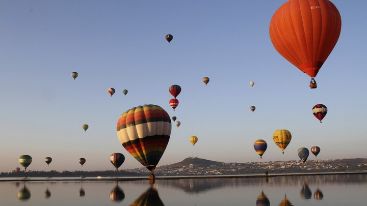

# Square Seam Carving

`python square.py img_file.xxx`

Saves an alternate `img_file_square.xxx` that is cropped to a square using seam carving for content aware image resizing. This will remove low energy seams from the image to keep important artifacts intact.
Energy in this context is the sum of the color derivatives of every pixel in the seam.

This calculates seams from top to bottom using dynamic programming with `O(img_height)` time complexity.

#### Requirements
`pip install -r requirements.txt`
- numpy
- opencv-python

#### Examples:
`python square.py examples/balloons.jpg`

Note how all balloons are kept in the crop and not distorted. This algorithm works best on images like this where the background is smooth.

Here is an illustration that shows the first seam removed. The image crops to a square by repeating this process until the height and width are equal.

`python square.py examples/penguins.jpg`

With high energy backgrounds, elements are sometimes distorted. Note the leftmost penguin.
